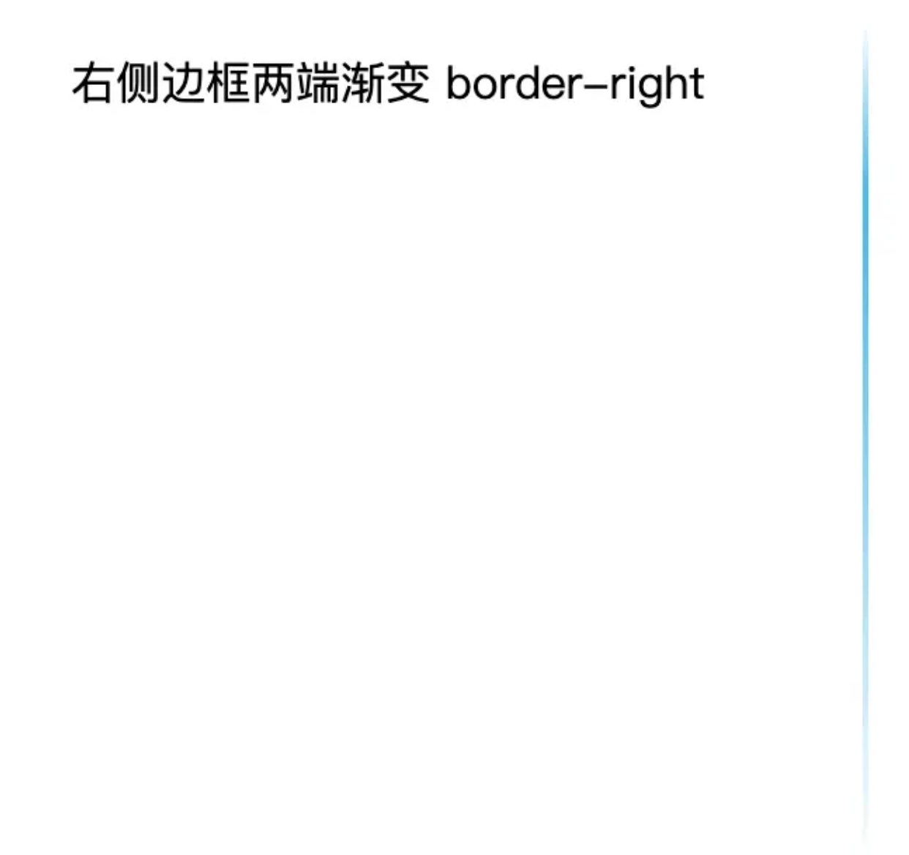

# 从中间到两边的渐变

```css
/*首先我们设置边框只显示右侧，宽度为2px的实线。*/
border-right: 2px solid;
/*设置线性渐变*/
border-image: linear-gradient(
    180deg,
    rgba(255, 255, 255, 0) 0%,
    #00bbf2 20%,
    rgba(255, 255, 255, 0) 99%
  ) 2 2 2 2;
/* 我们通过border-image设置（2 2 2 2）对图片做了裁剪 */

/* 方法二：线条设置背景 */
background: linear-gradient(
  180deg,
  rgba(255, 255, 255, 0) 0%,
  #00bbf2 20%,
  rgba(255, 255, 255, 0) 99%
);
```


