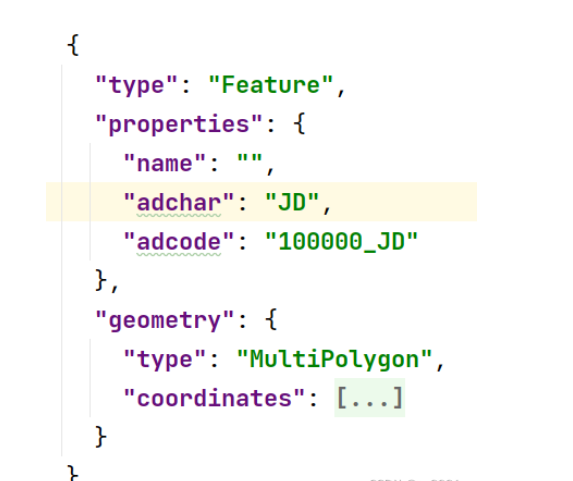
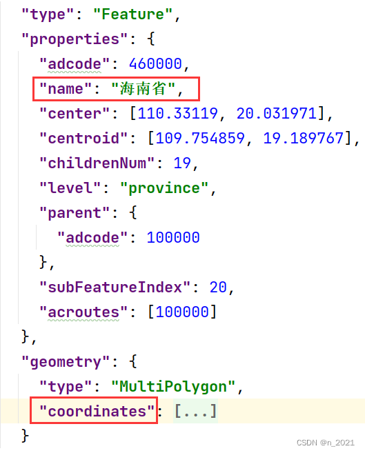

# map

[中国地图数据下载](https://datav.aliyun.com/portal/school/atlas/area_selector#&lat=31.840232667909365&lng=104.2822265625&zoom=4)

## 显示南海诸岛缩略图

问题原因在于地图注册的时候，China 的首字母大写，改成小写，就会出现缩略图

## 隐藏南海诸岛缩略图

### 1. 通过 geo.regions 配置项隐藏南海诸岛

```js
const option = {
  geo: {
    type: "map",
    map: "china", // 使用 registerMap 注册的地图名称
    regions: [
      {
        name: "南海诸岛",
        itemStyle: {
          areaColor: "#f7f7f7",
          normal: {
            opacity: 0, // 为 0 时不绘制该图形
          },
        },
        label: {
          show: false, // 隐藏文字
        },
      },
    ],
  },
};
```

### 2. 通过注册地图名称隐藏南海诸岛

修改 registerMap 注册的地图名称为“China”，然后在 geo.name 配置项中隐藏南海诸岛

```js
echarts.registerMap("China", chinamap); // 用导入的json文件注册一个name:China的地图组件
const option = {
  geo: {
    type: "map",
    map: "China", // 使用 registerMap 注册的地图名称
  },
};
```

## 隐藏南海诸岛边界线

### 1. **json 文件中**，删掉下面所示代码



```js
{
		"type": "Feature",
		"properties": {
			"name": "",
			"adchar": "JD",
			"adcode": "100000_JD"
		},
		"geometry": {
			"type": "MultiPolygon",
			"coordinates": [...],
		}
	}
```

### 2. 通过 regions 配置项隐藏

```js
// 1、在json文件中给南海诸岛信息n的ame添加值，如：南海诸岛
{
		"type": "Feature",
		"properties": {
			"name": "南海诸岛", // json文件中给南海诸岛信息的name添加值
			"adchar": "JD",
			"adcode": "100000_JD"
		},
		"geometry": {
			"type": "MultiPolygon",
			"coordinates": [],
		}
	}

// 2、在echarts配置项中配置regions隐藏南海诸岛
const option = {
       geo: {
         type: 'map',
         map: 'china',
         regions: [ // 隐藏南海诸岛
           {
             name: '南海诸岛',
             itemStyle: {
               areaColor: '#f7f7f7',
               normal: {
                 opacity: 0, // 为 0 时不绘制该图形
               },
             },
             label: {
               show: false, // 隐藏文字
             },
           },
         ],
       },
     };
```

### 3. 南海缩略图使用图片代替，腾讯健康、阿里统计目前是用图片来展示的

```js
/**
 * App模块
 */

import React, { Component } from "react";
import * as echarts from "echarts";
import china from "./china.json";
import { actions } from "mirrorx";

import "./index.less";

var convertData = function (data) {
  var res = [];
  for (var i = 0; i < data.length; i++) {
    res.push({
      name: data[i].county,
      value: [data[i].log, data[i].lot, data[i].eqCount],
    });
  }
  return res;
};

class Map extends Component {
  constructor(props) {
    super(props);
    this.ref = React.createRef();
    this.state = {
      myChart: null,
      option: {
        title: {
          x: "center",
          textStyle: {
            color: "#fff",
          },
        },
        tooltip: {
          trigger: "item",
          formatter: function (params) {
            return `${params.name} : ${params.value[2]} (${params.seriesName}) `;
          },
        },
        legend: {
          orient: "vertical",
          bottom: "3%",
          x: "10%",
          data: [],
          itemWidth: 10,
          itemHeight: 10,
          textStyle: {
            color: "#fff",
            fontSize: 12,
          },
        },
        geo: [
          {
            zlevel: 2,
            map: "china",
            left: 30,
            right: 30,
            top: "5%",
            regions: [
              {
                name: "南海诸岛",
                itemStyle: {
                  // 隐藏地图
                  normal: {
                    opacity: 0, // 为 0 时不绘制该图形
                  },
                },
                label: {
                  show: false, // 隐藏文字
                },
              },
            ],
            label: {
              normal: {
                textStyle: {
                  fontSize: 12,
                  color: "#fff",
                },
              },
              emphasis: {
                textStyle: {
                  fontSize: 12,
                  color: "#fff",
                },
              },
            },
            itemStyle: {
              normal: {
                areaColor: "#001D81",
                borderColor: "#2efbfd",
                borderWidth: 0.3,
              },
              emphasis: {
                areaColor: "#0a54ea",
              },
            },
          },
          {
            map: "china",
            left: 30,
            right: 30,
            top: "5%",
            regions: [
              {
                name: "南海诸岛",
                itemStyle: {
                  // 隐藏地图
                  normal: {
                    opacity: 0, // 为 0 时不绘制该图形
                  },
                },
                label: {
                  show: false, // 隐藏文字
                },
              },
            ],
            itemStyle: {
              normal: {
                borderColor: "#2efbfd",
                borderWidth: 1.6,
                shadowColor: "#00207e",
                shadowBlur: 40,
              },
            },
          },
        ],
        series: [],
      },
    };
  }
  async componentDidMount() {
    this.myChart = echarts.init(this.ref.current);
    echarts.registerMap("china", china);

    this.draw();

    let data = await actions.home.getMapData();
    this.setData(data);
  }
  setData(result) {
    if (result.result && result.result.data) {
      let arr = [];
      let data = result.result.data;
      let newOption = { ...this.state.option };
      newOption.legend.data = [];
      newOption.series = [];
      let obj = {};
      let color = ["#FFDD00", "#EB6D19", "#27B9F6", "#2CAE45", "#334553"];
      for (let i in data) {
        arr.push({
          name: i,
          data: data[i],
        });
      }
      // arr = arr.sort((a, b) => b.data.length - a.data.length).splice(0, 5);
      arr.forEach((item, index) => {
        newOption.legend.data.push(item.name);
        let obj = {
          zlevel: 3,
          name: item.name,
          type: "scatter",
          coordinateSystem: "geo",
          data: convertData(item.data),
          color: color[index],
          symbolSize: 6,

          itemStyle: {
            normal: {
              shadowColor: color[index],
              shadowBlur: 5,
            },
            emphasis: {
              borderColor: "#fff",
              borderWidth: 1,
            },
          },
        };
        newOption.series.push(obj);
      });
      this.setState({
        option: newOption,
      });
      this.draw();
    }
  }
  draw() {
    this.myChart.setOption(this.state.option);
  }
  render() {
    return <div className="full-height" ref={this.ref} />;
  }
}

Map.displayName = "Map";
export default Map;
```

## 隐藏南海诸岛

### 1、在 series 的 data 字段做以下设置

```js
option = {
  series: [
    {
      itemStyle: {
        normal: {
          color: function (params) {
            var colorList = ["#C1232B", "#B5C334", "#FCCE10"];
            return colorList[params.dataIndex];
          },
        },
      },
      name: "iphone3",
      type: "map",
      left: "20px",
      top: "10px",
      mapType: "china",
      roam: false,
      label: {
        normal: {
          show: false,
        },
        emphasis: {
          show: true,
        },
      },
      data: [
        {
          // ------------------------ 隐藏南海诸岛
          name: "南海诸岛",
          value: 0,
          itemStyle: {
            normal: { opacity: 0, label: { show: false } },
          },
        },
        { name: "北京", value: randomData() },
        { name: "天津", value: randomData() },
      ],
    },
  ],
};
```

### 2、在 geo 字段做以下设置

```js
geo: {
        map: 'china',
        label: {
            emphasis: {
                show: false
            }
        },
        regions: [
            {
                name: '南海诸岛',
                value: 0,
                itemStyle:
                    {normal:
                        {opacity: 0,
                        label: {
                            show: false

                        }
                    }
                }
            }],
        itemStyle: {
            normal: {
                areaColor: '#323c48',
                borderColor: '#404a59'
            },
            emphasis: {
                areaColor: '#2a333d'
            }
        }
    },


```

### 2、更换 JSON 中的坐标数据

这些岛屿都属于“海南省”，所以找到 json 文件中的“海南”，将其中的“coordinates”替换成下方代码：


```js
"coordinates": [
        [
          [
            [110.106396, 20.026812],
            [110.042339, 19.991384],
            [109.997375, 19.980136],
            [109.965346, 19.993634],
            [109.898825, 19.994196],
            [109.855093, 19.984073],
            [109.814441, 19.993072],
            [109.76147, 19.981261],
            [109.712195, 20.017253],
            [109.657993, 20.01163],
            [109.585312, 19.98801],
            [109.526797, 19.943573],
            [109.498464, 19.873236],
            [109.411001, 19.895184],
            [109.349407, 19.898561],
            [109.300748, 19.917693],
            [109.25948, 19.898561],
            [109.255784, 19.867045],
            [109.231147, 19.863105],
            [109.159082, 19.79048],
            [109.169553, 19.736411],
            [109.147379, 19.704863],
            [109.093792, 19.68965],
            [109.048829, 19.619764],
            [108.993394, 19.587065],
            [108.92872, 19.524468],
            [108.855424, 19.469182],
            [108.806148, 19.450561],
            [108.765496, 19.400894],
            [108.694047, 19.387346],
            [108.644772, 19.349518],
            [108.609048, 19.276661],
            [108.591186, 19.141592],
            [108.598577, 19.055633],
            [108.630606, 19.003017],
            [108.637997, 18.924346],
            [108.595497, 18.872256],
            [108.593033, 18.809386],
            [108.65278, 18.740258],
            [108.663866, 18.67337],
            [108.641077, 18.565614],
            [108.644772, 18.486738],
            [108.68912, 18.447571],
            [108.776583, 18.441894],
            [108.881293, 18.416344],
            [108.905315, 18.389087],
            [108.944735, 18.314107],
            [109.006329, 18.323198],
            [109.108575, 18.323766],
            [109.138756, 18.268081],
            [109.17448, 18.260125],
            [109.287813, 18.264671],
            [109.355566, 18.215221],
            [109.441182, 18.199303],
            [109.467051, 18.173718],
            [109.527413, 18.169169],
            [109.584696, 18.143579],
            [109.661688, 18.175424],
            [109.726362, 18.177698],
            [109.749767, 18.193618],
            [109.785492, 18.339672],
            [109.919767, 18.375457],
            [110.022629, 18.360121],
            [110.070672, 18.376025],
            [110.090382, 18.399309],
            [110.116867, 18.506602],
            [110.214186, 18.578662],
            [110.246215, 18.609859],
            [110.329366, 18.642185],
            [110.367555, 18.631977],
            [110.499366, 18.651824],
            [110.499366, 18.751592],
            [110.578206, 18.784458],
            [110.590525, 18.838841],
            [110.585597, 18.88075],
            [110.619474, 19.152334],
            [110.676756, 19.286264],
            [110.706321, 19.320153],
            [110.729727, 19.378878],
            [110.787009, 19.399765],
            [110.844292, 19.449996],
            [110.888023, 19.518827],
            [110.920668, 19.552668],
            [111.008747, 19.60398],
            [111.061718, 19.612436],
            [111.071573, 19.628784],
            [111.043856, 19.763448],
            [111.013675, 19.850159],
            [110.966248, 20.018377],
            [110.940994, 20.028499],
            [110.871393, 20.01163],
            [110.808567, 20.035808],
            [110.778386, 20.068415],
            [110.744509, 20.074036],
            [110.717408, 20.148778],
            [110.687843, 20.163947],
            [110.655814, 20.134169],
            [110.562191, 20.110006],
            [110.526467, 20.07516],
            [110.495054, 20.077408],
            [110.387265, 20.113378],
            [110.318279, 20.108882],
            [110.28933, 20.056047],
            [110.243135, 20.077408],
            [110.144585, 20.074598],
            [110.106396, 20.026812]
          ]
        ]
      ]
```

# 参考文章

- https://blog.csdn.net/n_2021/article/details/132836912
