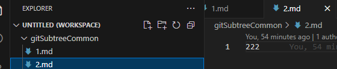
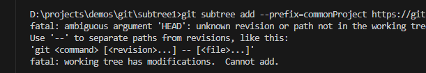
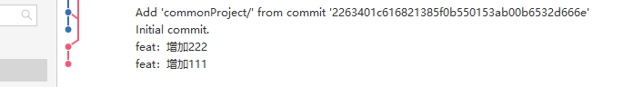
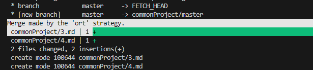
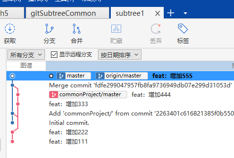

# subtree
## 1、创建一个具有通用功能的项目gitSubtreeCommon
```bash
https://github.com/foolvip/gitSubtreeCommon.git
```
## 2、新增两个commit


## 3、创建一个具有定制化功能的项目subtree1
```bash
https://github.com/foolvip/subtree1.git
```
## 4、在subtree1项目里先添加一次提交(不然下面直接添加通用项目会报错)

```bash
git commit --allow-empty -n -m "Initial commit."
```
## 5、在subtree1项目里运行下面的命令
```bash
git subtree add --prefix=commonProject https://gitlab.meditrusthealth.com/foolvip/gitSubtreeCommon.git master
```

- 1）、会在subtree1项目中创建一个commonProject项目文件夹，并且会拉取gitSubtreeCommon项目中的文件到subtree1项目中commonProject文件夹下
- 2）、commonProject目录下是没有 .git 的，它不是一个单独的 git 项目，只是一个普通目录
- 3）、gitSubtreeCommon项目中的提交记录也会存在subtree1中，同时还会多生成一个merge的commit


## 6、subtree1中的commonProject子项目仍然独立，能单独 pull 和 push
1. 在 gitSubtreeCommon 这个项目下加两个 commit(3.md、4.md)
2. 在subtree1项目中运行下面的命令拉取，通用项目的最新改动就拉下来了
```bash
git subtree pull --prefix=commonProject https://gitlab.meditrusthealth.com/foolvip/gitSubtreeCommon.git master
# 添加remote名称，简化拉取命令
git remote add commonProject https://gitlab.meditrusthealth.com/foolvip/gitSubtreeCommon.git
# 简化后拉取命令
git subtree pull --prefix=commonProject commonProject master
# 添加--squash，只有一个合并（通用项目gitSubtreeCommon多次提交）后的 commit，一个 merge commit
git subtree pull --prefix=commonProject commonProject master --squash

```


## 7、在subtree1的commonProject文件夹下新增5.md文件
暂存、提交、推送远程




